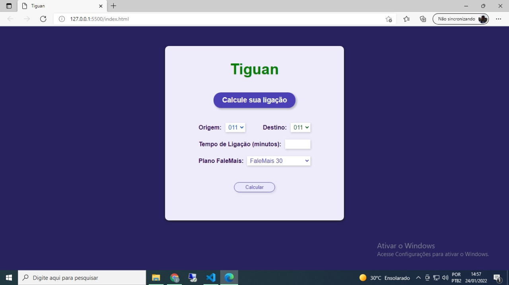
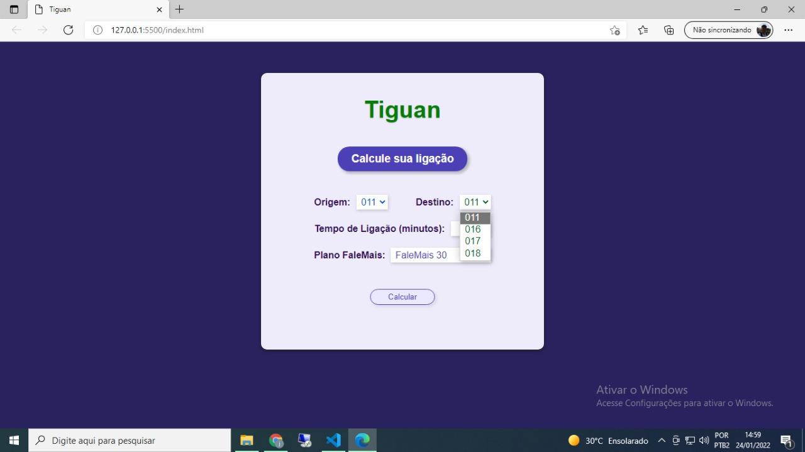
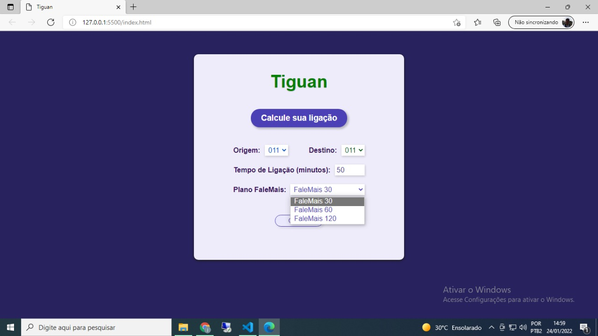
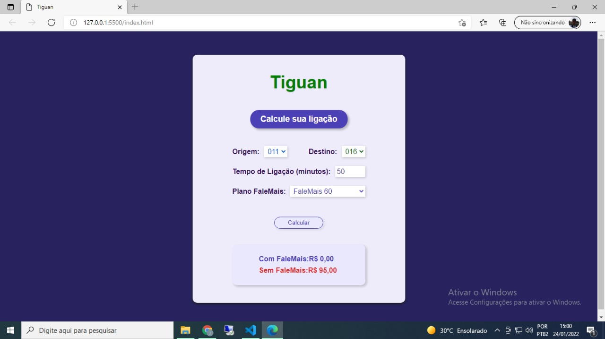
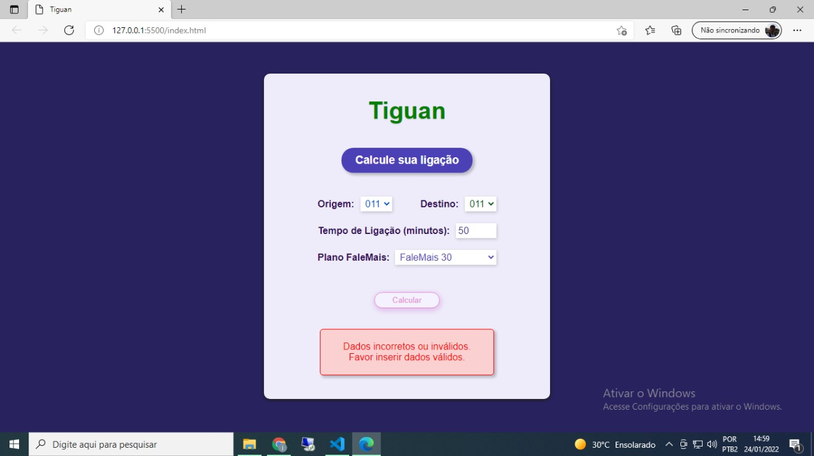
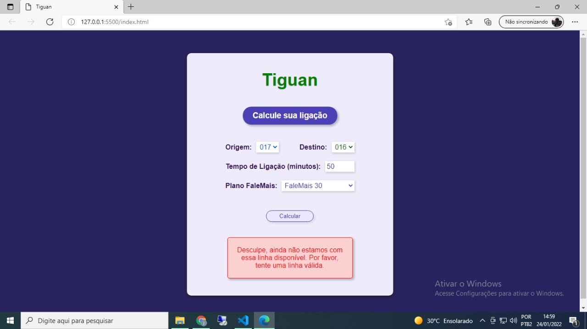

# Início

  Esse repo guarda uma página simples feita com Javascript, HTML, CSS e Express. Ela foi criada para o usuário calcular o valor de sua ligação com e o plano da operadora através de diferentes rotas. 

# Baixando e rodando a Aplicação 

Baixe o arquivo. Em sequência, abra o terminal no local que contém a pasta do arquivo. Caso já possua o node instalado no computador, instale o pacote npm com o comando npm install express -- save. Instale também o pacote do nodemon com o comando npm install nodemon -g.

Digite nodemon app.js

Se tudo funcionou bem, vc está pronto para ir. 

Obs: orientações aplicáveis ao Windows. 

# Sobre o Front

  #### Aqui iniciamos nossa aplicação. Ela é simples. Nessa tela, o usuário pode calcular o valor de uma ligação com um dos três planos da operadora ou sem o plano. Saliento que o valor calculado com o plano não considera o valor pago pelo plano.
  
  
  
  

  #### Continuando, temos dois selects em que o usuário tem opções de escolher o DDD de origem e de destino para sua ligação:
  
  
  
  ..

  
  
  
  #### Por conseguinte, ele insere os minutos que durará sua ligação e o plano da operadora ele escolhe num select:
  
  
  
  
  
  Então, ele tem o resultado:
  
  
  
  
  
  #### Importante salientar que caso a ligação do usuário ultrapasse os minutos do seu plano, ele pagará uma taxa pela ligação. Então, caso ele tenha o plano FaleMais30 e faça uma ligação de 50 minutos, ele pagará uma taxa pelos minutos excedentes. 
  

  
  
  
  #### Também há avisos caso o usuário selecione os dados incorretamente ou uma rota não existente. 
  
  
  
  
  
  ..
  
  
  
  
  
  

